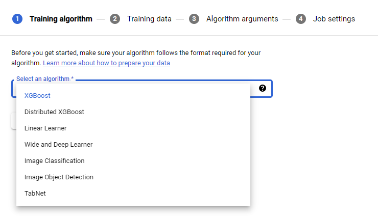
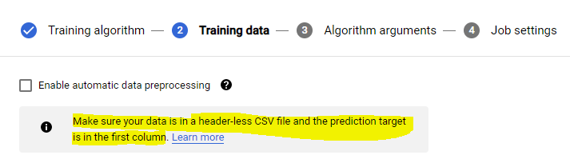
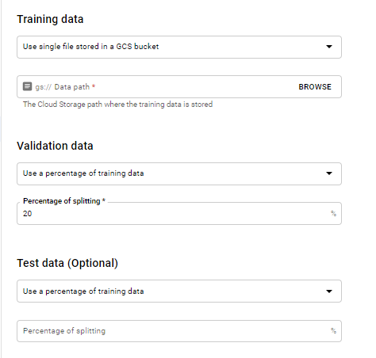
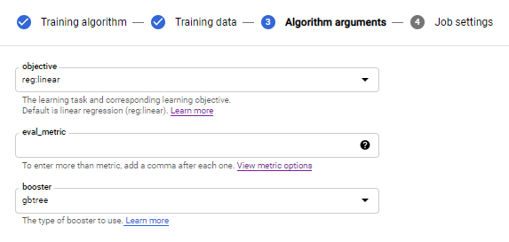
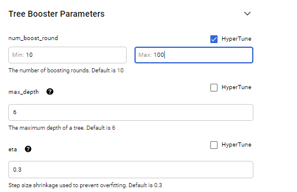
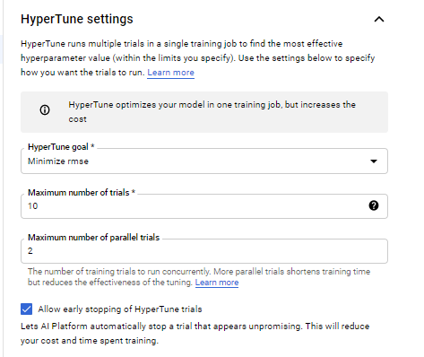
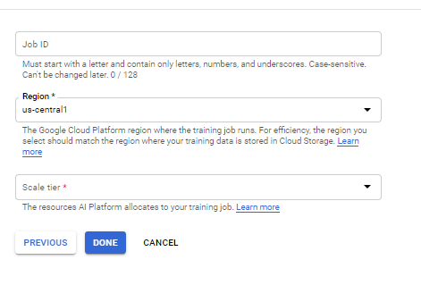

# Built-in algorithms

- Built-in algorithms covers gap between AUTO ML and full custom model. 
- you can select sepcific algorithm to train, it can also handle pre-processing , can do hyperparameter tuning & train model for you. 

# Limitation
- Distributed training is not supported. To run a distributed training job on AI Platform Training, you must create a training application
- GPUs are supported for some algorithms
- Multi-GPU machines do not yield greater speed with built-in algorithm training. If you're using GPUs, select machines with a single GPU
- TPUs are not supported for tabular built-in algorithm training

# supported algorithm

| Algorithm  | Supported accelerators for training | Type of problem |
| ------------- | ------------- |------------- |
| Linear learner  | Classification, regression | GPU|
| Wide and deep | Classification, regression, ranking	| GPU|
| TabNet | Classification, regression	| GPU|
| XGBoost | Classification, regression		| None (Only CPU) [they have distributed XGboost]|
| Image classification | Classification	| GPU, TPU|
| Object detection | Detecting objects within complex image scenes| GPU, TPU|

# How to use it (XG boost)

## Step 1 : select algorithm

## Step 2 : enable or disable automatic pre-processing 
- if data is already pre-processed , disable this option in this case you have to provide seperate validation/Test set file.
- if its enabled you can define percentage of the data to use as validation/test set. 
- file is expected to be in sepcific format 

## Step 3: define train, validation & test set 

## Step 4: Define algorithm arguments like objective function , eval matrics 

## Step 5: Hyperparameter tuning, select hypertune option to define range of parameter for hypertune to try

## Step-6: define early stopping , max trials, no of parallel trails & objective function (Like minimize rmse)

## Step 7: Define region & scale tier, submit

