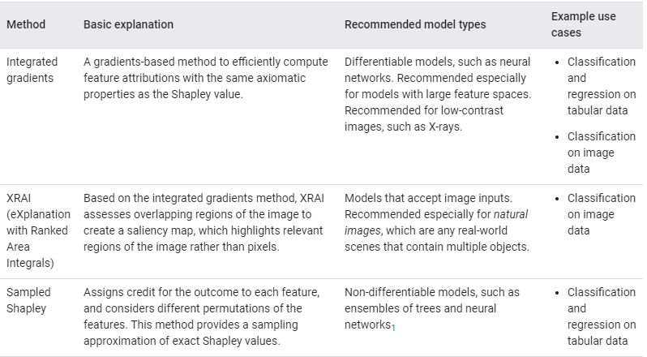

# AI platform- Model explanation

- Explanation (feature attribution) for each and every prediction helps you to understand model output for classification and regression
- Available for tabular data as well as image data 
- **Limitation: only supports model trained on TensorFlow 1.x if you are using keras than have to convert into estimators using model to estimator utility** 
  - tf.keras.estimator.model_to_estimator(keras_model=estimator_model) [Now it supports tensorflow 2.0]
  
# Methods

- AI explanation offers two method. **Both methods are based on concept of SHAP values**.
- - XRAI -> images (XRAI is based on Integrated Gradients and also can’t be used on non-differentiable models)
  - Integrated gradients -> everything else that’s differentiable. 
  - Sampled Shapley -> only for ensembles and other non-differentiable models

## Sampled shapely
- For non-differentiable models such as ensemble models of tree
## Integrated gradients
- most suitable for differential models like deep neural network 
- especially useful for model having large feature space
- it computes gradients of an output with respect to input. Multiplied element wise with input itself (Taylor approximation of predicted function at input)
## XRAI
- XRAI combines integrated gradients method with additional steps to determine which region of image contribute to the class prediction rather than pixel level.
- Original image -> ( over-segment Image + Pixel-based attribution (Integrated gradients)) -> sum attributions & identify important region -> most important region for predicted class

## Summary

## Limitation of attribution methods
- Feature attribution method show how much features are affecting specific example, it cant be generalized ie. it might not reflect overall behaviour
- to understand at overall dataset , aggregate for all examples 
- attribution entirely depends on model & data used for training, if data has biased than model explanation will also have bias. 
- this method alone cant tell you that model is unfair & unbiased 
- **Improving feature attributions**
  - its approximation of sampled shaply values. we can increase the precision of values 
    - Increasing the number of integral steps for the integrated gradients or XRAI methods.
    - Increasing the number of integral paths for the sampled Shapley method.
  - feature attribution explains feature affected change in prediction relative to baseline value. if you change baseline than attribution might change significantly 
  - For integrated gradients and XRAI, using two baselines can improve your results. For example, you can specify baselines that represent an entirely black image and an entirely white image.
- **Limitations for image data**: 
  - Integrated gradients is a pixel-based attribution method that highlights important areas in the image regardless of contrast, making this method ideal for non-natural images such as X-rays
  - XRAI works best on natural, higher-contrast images containing multiple objects. Because this method produces region-based attributions, it produces a smoother, more human-readable heatmap of regions
  - XRAI does not work well with 
    - Low-contrast images that are all one shade, such as X-rays.
    - Very tall or very wide images, such as panoramas.
    - Very large images, which may slow down overall runtime

 
