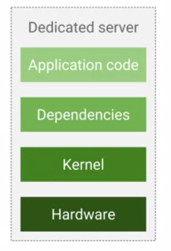
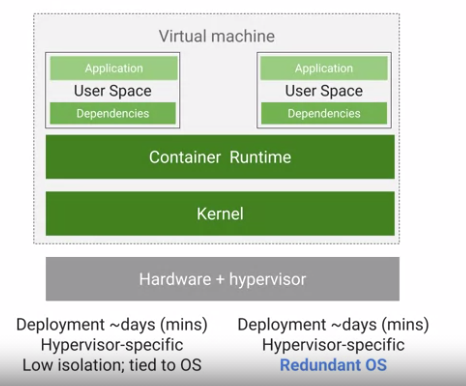
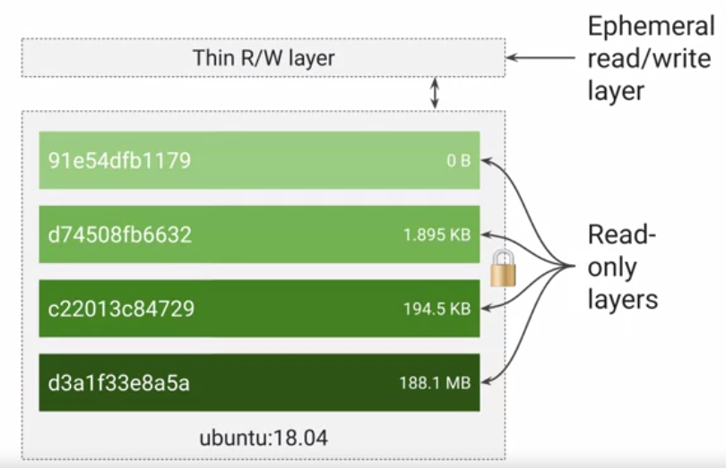
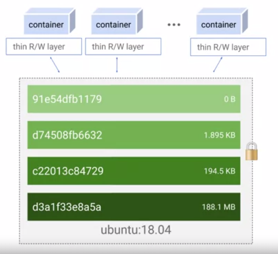
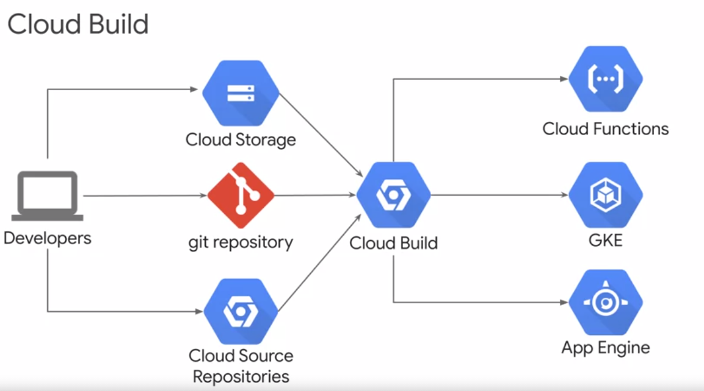

## What is Containers

- Historically to deploy solution we use to have dedicated servers which means waste of resources, scaling was difficult, not portable. For ex: database will be deployed on one VM, when queries are not running or partially used the resources are wasted.

- **Virtualization**: run multiple virtual serves on same physical computer. Hypervisor is software layer which breaks dependencies OS with hardware so that multiple virtual machine to share same hardware. Disadvantages of the historic system has been removed but still application is tightly coupled with application and its dependencies.

- To resolve issue of dependency problem is to abstract at user space level which is nothing but containers. **Containers are isolated user spaces to run application code**.

## Images
- Application & its dependencies are called Images 
- container is running instances of images 
- **Software which builds and runs containers is called Docker**
- **Docker does not orchestrate the containers, for that we will need kubernetes.**
- **Google cloud build is used to create docker formatted container images**

## Inside Containers
- Container uses set of Linux technologies like Linux processes, Linux namespace, cgroups & union file system.
  - Linux processes: any command is excuted in linux/unix it creates a process (PID) with all required resources 
  - Linux name space to restrict what application can see
  - Cgroups restricts max CPU utilization memory & IO bandwidth 
  - Union file system to encapsulate application and its dependencies 
- Container image is structured in layers. **Docker file is nothing but set of instruction to create layer in the image. Each layer is read only. It will also have writeable ephemeral top layer also called as container layer.**

- When you want to store data permanently than we have to do somewhere else
- Since all container has their own storage, they can all access to common base layer.

- Container registry by google called gcr.io. contains public open source images. Others are docker hub, GitHub
- **We can build own container using open source docker command, google has cloud build for that.**

