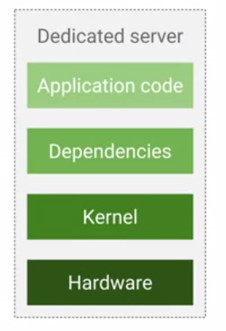
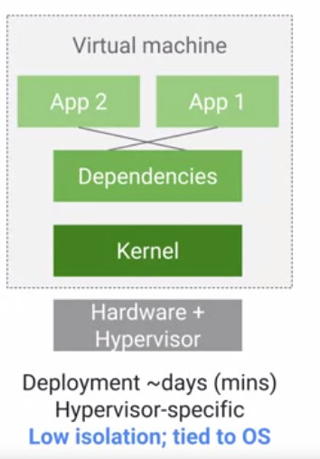
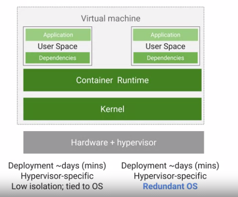
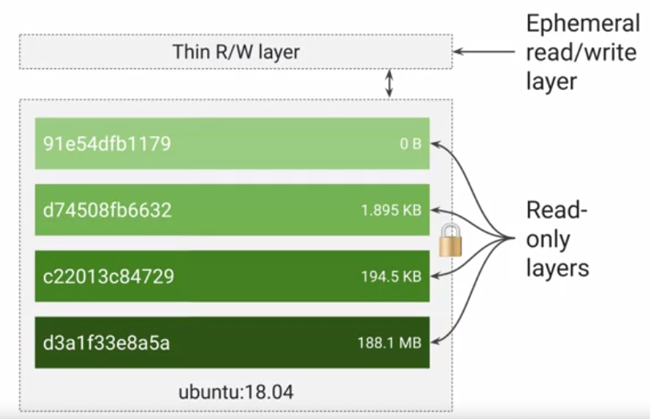
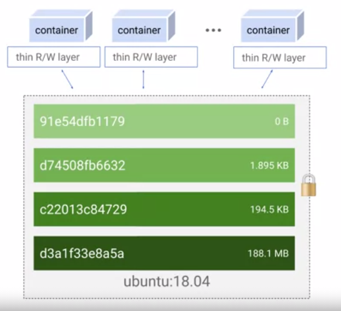
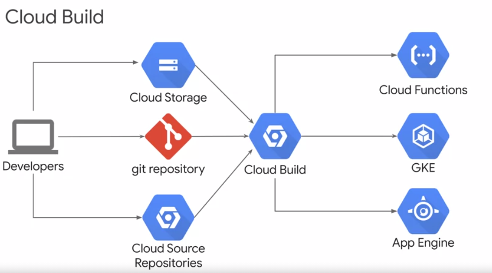
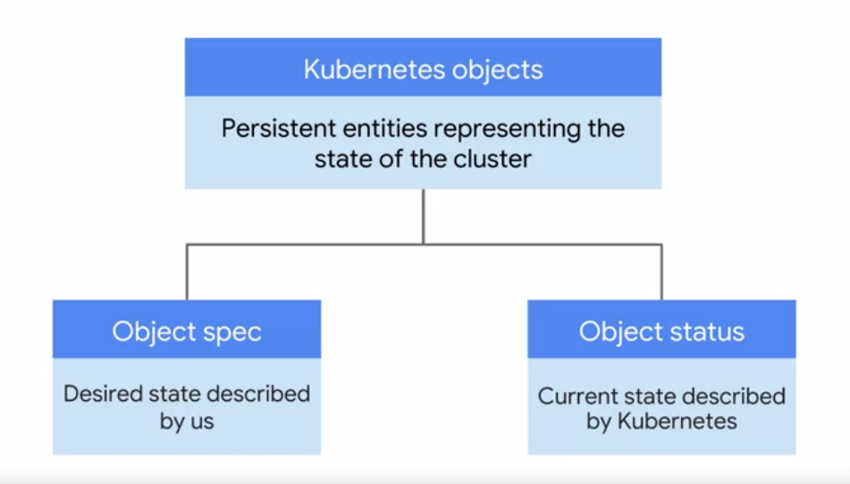
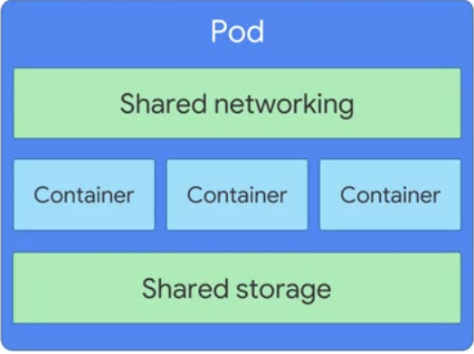
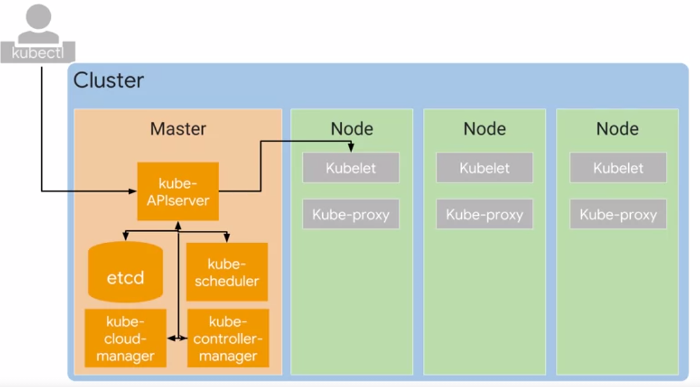

## What is Containers

- Historically to deploy solution we use to have dedicated servers which means waste of resources, scaling was difficult, not portable. For ex: database will be deployed on one VM, when queries are not running or partially used the resources are wasted.

- **Virtualization**: run multiple virtual serves on same physical computer. Hypervisor is software layer which breaks dependencies OS with hardware so that multiple virtual machine to share same hardware. Disadvantages of the historic system has been removed but still application is tightly coupled with application and its dependencies.

- To resolve issue of dependency problem is to abstract at user space level which is nothing but containers. **Containers are isolated user spaces to run application code**

## Images
- Application & its dependencies are called Images 
- container is running instances of images 
- **Software which builds and runs containers is called Docker**
- **Docker does not orchestrate the containers, for that we will need kubernetes.**
- **Google cloud build is used to create docker formatted container images**

## Inside Containers
- Container uses set of Linux technologies like Linux processes, Linux namespace, cgroups & union file system.
  - Linux processes: any command is excuted in linux/unix it creates a process (PID) with all required resources 
  - Linux name space to restrict what application can see
  - Cgroups restricts max CPU utilization memory & IO bandwidth 
  - Union file system to encapsulate application and its dependencies 
- Container image is structured in layers. **Docker file is nothing but set of instruction to create layer in the image. Each layer is read only. It will also have writeable ephemeral top layer also called as container layer.**

- When you want to store data permanently than we have to do somewhere else
- Since all container has their own storage, they can all access to common base layer.

- Container registry by google called gcr.io. contains public open source images. Others are docker hub, GitHub.
- **We can build own container using open source docker command, google has cloud build for that.**

## Kubernetes
- Application running inside container needs to communicate with each other, kubernetes helps you here 
- its container management & orchestration engine.

#### Advantages
- Supports both stateful and stateless application 
- Autoscaling 
- Resource limitation: define how much an application can use 
- Portability between multiple cloud providers and on-premise 

## GKE (Google kubernetes engine)
- Managing infrastructure of kubernetes is difficult job 
- GKE is managed service within google cloud manage infrastructure 
- **Features**:
  - Fully managed
  - **Container optimized os**: maintained by google to scale quickly 
  - **Auto upgrade**: kubernetes system is called cluster. it will update cluster with latest version of kubernetes
  - **Auto repair**: VM that hosts your containers inside GKE cluster called nodes. Repair unhealthy nodes.
  - **Cluster scaling**: as kubernetes supports scaling of workloads, GKE supports scaling of cluster
  - Dashboard to view and manage the nodes
  
## How kubernetes works
- **Kubernetes object model**: Each thing is represented as an object 

- **Declarative management**: declare state of the object. Its kubernetes job to maintain object in that state

## Pods & Nodes
- Pods are basic building block.They are the smallest deployable object & not the containers.
- Pod is nothing but environment where container runs, one pod can have one or more containers
- Pods runs on nodes. Nodes is worker machine in kubernetes (VM in cluster)
- Containers within pods are tightly coupled. They share resources like IP address & storage, they can communicate internally using local host

 

## Kubernetes components 

 

- Job of nodes is to run pods and job of master is to coordinate
- **kubeAPIserver** is component we will interact with using **kubectl**, it will view or change state of the cluster including launching pods
- **etcd**: clusters database, stores state of the cluster, what pods and where it should be running.
- **Kubelet** is the kubernetes agent on each node. When kube API wants to start node on the POD it will connect with kubelet
- GKE manages all the control pane. GKE is more about nodes. if we are using just kubernetes and not GKE, cluster admin has to create nodes & add them to kubernetes.
