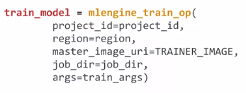
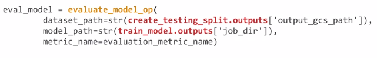
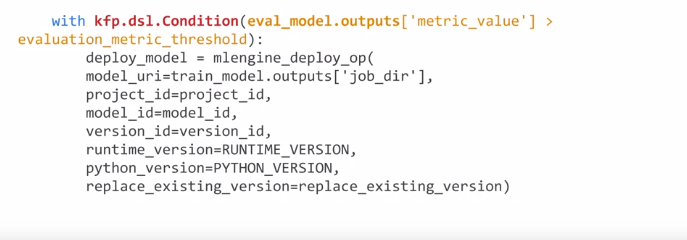
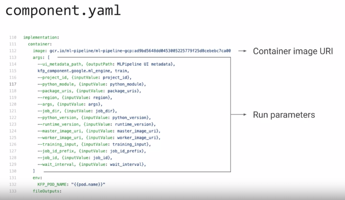
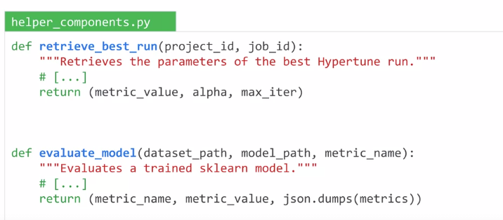
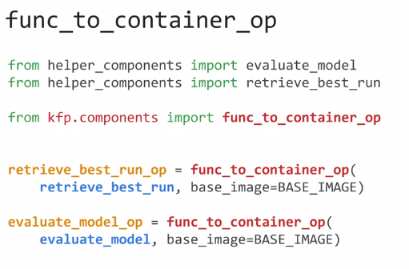
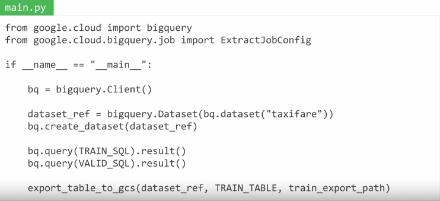
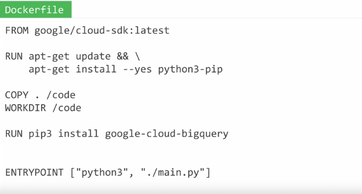
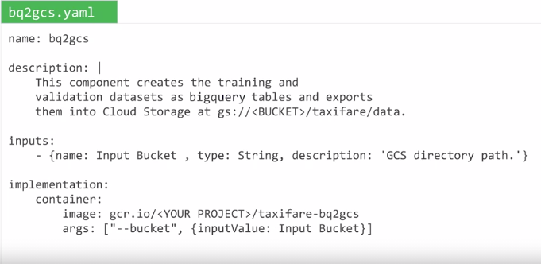
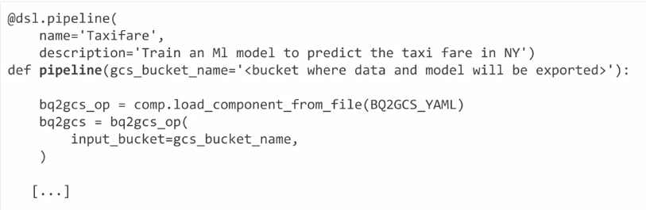

# Kubeflow 

- Kubeflow provides standardized platfom for building ML pipelines & build on top of kubernetes 
- kubeflow is build on three principle composability, protability & scalability
- each task of the pipeline is seperate containers & sequence of steps can be specified by python SDK
- There are prebuild components available which can be directly used & this helps to share functionality across different use case for ex: same word2vec container can be used in two different ML pipeline

# Kubeflow Components

- **hosted jupyter notebook** : kubeflow installation comes with hosted jupyter notebook. it can dynamically scale resources
- **katlib** : used for automated hyperparameter tuning 
- **kubeflow pipeline** : based on containers so each step is portable. same pipeline code can be run across environment
- **KFServing** : helps to server ML model built on Knative. it can also be served using TF serving 
- **metadata management** : managing artifcates produces by ML pipelines & metadata (track runs,model info, dataset, description & types of model). it uses MLMD

# Kubeflow Pipeline with KF DSL

- it is python SDK to describe kubeflow pipeline task as they organize themselfs as DAG
- Define kubeflow pipeline function using SDK
- Define task DAG inside pipeline function body 
  - create the ops: docker container consist of one step
  
  
  - compose them into DAG: o/p of one component as input to other component
  
   
  - conditional trigger: if you want to trigger task on the basis of some condition
  
  
# kubeflow component

- kubeflow component can be categorized into 3 types
    - Prebuild component : load prebuild component
    - light weight component : implement the component code
    - custom component : 
      - implement code 
      - package into docker
      - write component description

- Prebuild component:
  - get the uri of prebuild component YAML file component.YAML [https://github.com/kubeflow/pipelines/blob/master/components/gcp/bigquery/query/to_CSV/component.yaml] 
  - component.YAML file is component description & readme file gives runtime parameters to that ops

- Lightweight component:
  - wrap python function into KF Components using func_to_container_op
  - Step 1: write helper function 
    
    
  
  - Step 2: wrap helper function & use as prebuild component

    

- Custom component:
  - if any function is written in different language or more complex python code is needed than custom component is useful 
  - Steps to write custom component 
    - write code (any language)
    
      
    - docker file to package into docker container
    
      
      
    - build & push docker to container registry
    - describe component in component.YAML file
    
    
    
    - use description file to load component into pipeline
    
    
